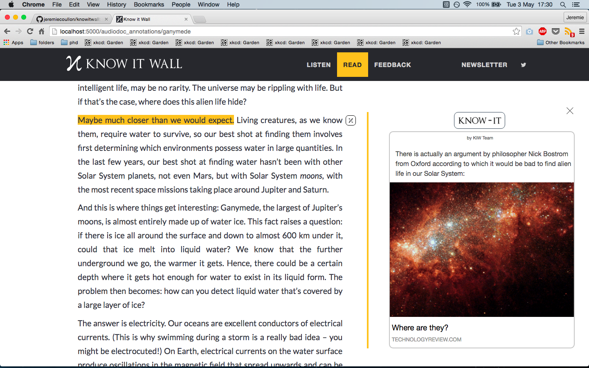

Knowitwall
==========
*Know it Wall (KiW) is a newly founded public engagement website, based at UCL, that aims to popularise research across all disciplines from arts to sciences.
KiW takes 1,000-word scripts that academics write on research worth sharing with the wider public and turns these into short audio-documentaries (less than 10 minutes long). Once produced, both audio-documentaries and scripts are published on KiW’s website –knowitwall.com – as well as on iTunes, Soundcloud and Medium.*


To get Knowitwall running locally:

- install packages in `requirements.txt`
- run `run.py`

##Current Annotator design:

Here is the current annotation design.



To reproduce this annotation, create an annotation and copy the html below into it. We'll first get annotations on the site in this way before allowing users to add them themselves (which will need a nice interface).

```html
<div class="entire_knowit">
<div class='knowit_author'>by KiW Team</div>
<div class='knowit'><div class='knowit_message'>There is actually an argument by philosopher Nick Bostrom from Oxford according to which it would be bad to find alien life in our Solar System:
 </div><a href="https://www.technologyreview.com/s/409936/where-are-they/" target='_blank' ><div class='knowit_link'>
<p class='knowit_title'>Where are they?</p><p class='knowit_url'>TECHNOLOGYREVIEW.COM</p></div></a></div>
</div>
```

###TODO

- **on mobile:**
  - Must have no 'knowit button'
  - The annotation (same design) appears above (or below) the highlighted bit of text
  - Open/close the annotation by clicking on the highlighted text. Close by clicking on the 'close' button (the black cross)

###Set up Annotation library
*The annotation library: [Annotator.js](http://annotatorjs.org/)*

- to get the annotations working with this [backend store](http://annotateit.org/):
  - make sure that `annotator-full-1.2.7-modified.js` is pointing to the that backend store. Namely, modify line 3019:

  ```javascript
  prefix: config.storeUrl || 'http://annotateit.org/api',
  ```
  - log in via Facebook or twitter at `http://localhost:5000/supersecretlogin`
  - add your account to admin group in `views.py`:

  ```python
  create_permission = ['jeremie.coullon']
  ```
