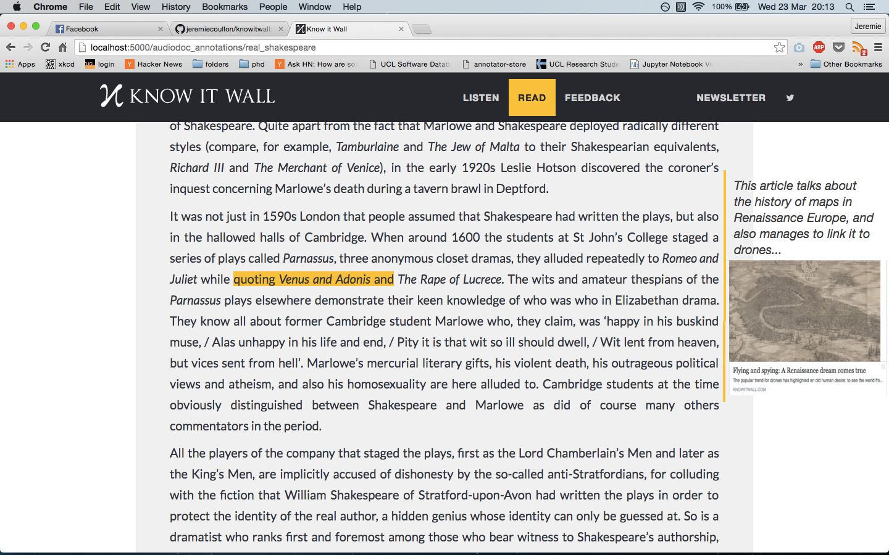

 Knowitwall
==========

To get Knowitwall running locally:

- install packages in `requirements.txt`
- run `run.py`

Annotations
===========

###Annotator design:

- The first step is to get a simple design and play with to see how it is (in terms of usability) and what needs to be done next:

_Each annotation must include a URL (an article on a 3rd party site) and a short message explaining what the article is about):_

**process for a user creating an annotation.**

- user highlights text, types in a message which includes a URL.
- frontend finds URL (regex), and fetches from it:
  - og:title
  - og:image
- The created annotation then becomes like when you post a URL as a facebook post; namely has the info in the following order:

message|
------|
|**og:image**|
|**og:title**|
|**URL** |

--------

- maybe have `og:description` (or just the beginning of it) between `og:title` and URL (like on facebook); though it's less necessary as you already have the message from the user on top.
- `og:image`, `og:title`, and URL are all clickable, and redirect to the URL (like on facebook)

**Example design:**
(the font size under the image weird as it's just a screenshot of a facebook post :p). We'd need to play around with the size of everything to make it look less crowded. maybe quite a small image ?

</img>

**Stuff to do:**
- <del>have the vertical yellow line like in the image above</del>
- <del>have the adder (the square that appears when you highlight text) appear next to the mouse.</del>
- <del>be able to click on the highlighted section of text and have the annotation stay visible. Click again to hide it.</del>
- <del>when creating an annotations we need to display 2 boxes. This needs to be setup in the backend store though..</del>
  - <del>one box for the text (with a character limit, say 200)</del>
  - <del>one box for the URL to the 3rd party content</del>
- **Displaying URLs:** user can paste any hyperlink into the message, and frontend fetches `og:image`, `og:title`, and displays as above
- **bug**: when you have a URL in the annotation, it doesn't always display on the right hand side, and instead puts it somewhere in the middle of the text (so covers up some of the episode's text). I can't reproduce this again though; but look out for it  #rigorous


###Annotation library
*The annotation library: [Annotator.js](http://annotatorjs.org/)*

- to get the annotations working with this [backend store](http://annotateit.org/):
  - make sure that `annotator-full-1.2.7-modified.js` is pointing to the that backend store. Namely, modify line 3019:

  ```javascript
  prefix: config.storeUrl || 'http://annotateit.org/api',
  ```
  - log in via Facebook or twitter at `http://localhost:5000/supersecretlogin`
  - add your account to admin group in `views.py`:

  ```python
  create_permission = ['jeremie.coullon']
  ```

###Annotator frontend

- when a user creates an annotation, `annotator-full-1.2.7-modified.js` creates the html tags with the annotator classes (as an unordered list) and positions them relative to where the annotation was created.
- the position of the adder and the annotation is determined in the `div` with classes `annotator-outer annotator-viewer annotator-invert-x annotator-hide`. These classes are defined in `annotator-KIW.css`.
