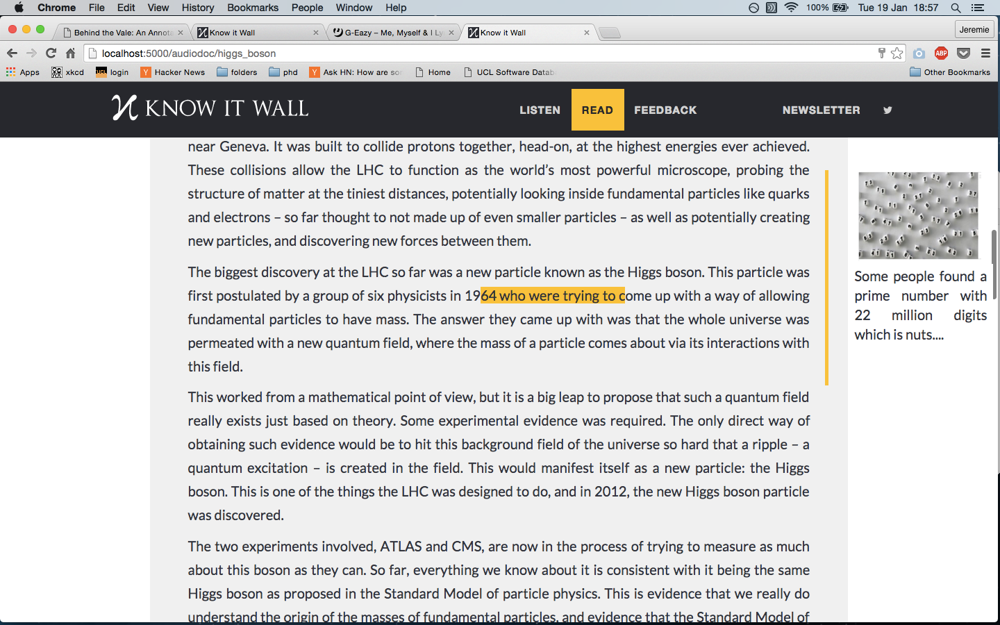

Knowitwall
==========

To get Knowitwall running locally:

- install packages in `requirements.txt`
- run `run.py`

If on the **`user_login_OAuth` branch:**

*The annotation library: [Annotator.js](http://annotatorjs.org/)*

- to get the annotations working with this [backend store](http://annotateit.org/):
  - make sure that `annotator-full-1.2.7.modified.js` is pointing to the that backend store. Namely, modify line 3019:

  ```javascript
  prefix: config.storeUrl || 'http://annotateit.org/api',
  ```
  - log in via Facebook or twitter at `http://localhost:5000/supersecretlogin`
  - add your account to admin group in `views.py`:

  ```python
  create_permission = ['jeremie.coullon']
  ```

###Annotator design:

- The first step is to get a simple design and play with to see how it is (in terms of usability) and what needs to be done next.

**Simple design:**

</img>


**Stuff to do:**
- have the vertical yellow line like in the image above
- display the URL to the 3rd party content nicely (dunno how this should look...)
- get the image for the article (like the thumbnail when you post articles on facebook) and display it above the text (like in the image above).
- have the adder (the square that appears when you highlight text) appear next to the mouse. Right now it appears on the right hand side (due to the `left: 90%` explained below).
- be able to click on the highlighted section of text and have the annotation be visible (and stay visible). Click on it again (or on another annotation) to hide it.
- when creating an annotations we need to display 2 boxes. This needs to be setup in the backend store though..
  - one box for the text (with a character limit, say 200)
  - one box for the URL to the 3rd party content


###Annotator frontend

- when a user creates an annotation, `annotator-full-1.2.7.modified.js` creates the html tags with the annotator classes (as an unordered list) and positions them relative to where the annotation was created.
- the position of the adder and the annotation is determined in the `div` with classes `annotator-outer annotator-viewer annotator-invert-x annotator-hide`. These classes are defined in `annotator-KIW.css`.
- `line 254` of `annotator-full-1.2.7.modified.js` adds a style to that `div`; it's now always at 90% rather than at the position the mouse was when the annotation was created:
```javascript
left: parseInt('90') + '%' //e.pageX - offset.left
```
- the class `annotator-hide` makes the annotations visible only when the mouse hovers over the highlighted section of text.
