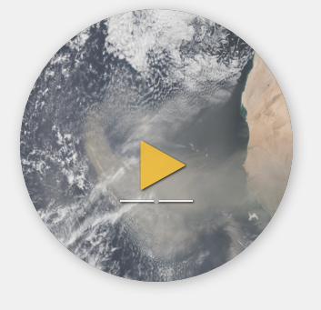
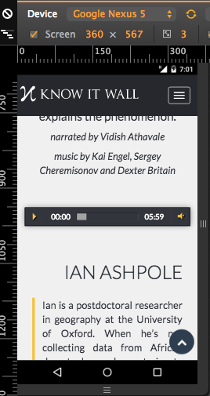

Knowitwall
==========

To get Knowitwall running locally:

- install packages in `requirements.txt`
- run `run.py`

If on the `circular_player` branch:

**Aim:** have a circular player rather than the current bar player

- on mobile: this is needed as the bar player is really short:

- on desktop: this may be nice but not as necessary, and hard to get right design-wise.

**suggested code:**

- This [codepen example](http://codepen.io/Stanssongs/pen/rszqt) has a nice circular player based on the HTML5 audio tag (the player above uses this). It has a problem though: you can't move to a different point in the song by clicking on a different point of the progress bar. This adapted version (in the screenshot above) is in `test circular player.zip`
- To fix this, can mix it with this [tutorial](https://serversideup.net/style-the-html-5-audio-element/) which shows how to style an HTML5 audio player (not circular thougMh). This tutorial shows how to interact with the progress bar.
- another example of a circular player is [http://www.jplayer.org/](http://www.jplayer.org/) but this seems a bit complicated and doesn't use the HTML5 audio player tag. Also changing the background image and progress bar colour seems a bit weird..

**TODO:**

- get a circular player styled as the screenshot above
- can use the suggested tutorials above or find a circular player online who's progress bar is interactive (though I couldn't find this)
- replace the bar player with the circular one on mobile (with the topic image inside the circle), but leave the normal bar player on desktop (at least for the moment)
